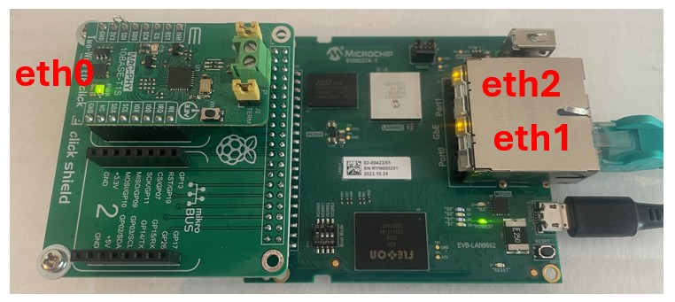

# LAN8651 BSP Patcher

**BSP Version: 2025.12**

This repository contains scripts and patches for building and customizing a Microchip BSP (Board Support Package) with LAN8651 Ethernet PHY support and AIoT Wedge customizations.

## Table of Contents

- [Overview](#overview)
- [Architecture](#architecture)
- [Files](#files)
- [Quick Start](#quick-start)
- [Build Process Details](#build-process-details)
- [Customizations in Detail](#customizations-in-detail)
- [Hardware Configuration](#hardware-configuration)
- [Build Output](#build-output)
- [Update Procedure](#update-procedure)
- [Manual Board Programming](#manual-board-programming)
- [Important Notes for BSP 2025.12](#important-notes-for-bsp-202512)
- [Troubleshooting](#troubleshooting)
- [Development Notes](#development-notes)
- [Network Configuration](#network-configuration)
- [Official Documentation](#official-documentation)
- [License & Attribution](#license--attribution)
- [Support](#support)

## Overview

The BSP Patcher automates the process of downloading, patching, and building a customized version of the Microchip BSP with specific network configurations, MQTT support, and update mechanisms tailored for embedded AIoT applications.

## Architecture

```
┌─────────────────────┐     ┌──────────────────────┐    ┌─────────────────────┐
│  Build Script       │     │  Patch File          │    │  Target Hardware    │
│  build_with_        │───▶│  prebuild_lan8651_   │───▶│  LAN966x + LAN8651  │
│  lan8651_patch.sh   │     │  customizations...   │    │  Embedded System    │
└─────────────────────┘     └──────────────────────┘    └─────────────────────┘
```

## Files

### Core Files
- `build_with_lan8651_patch.sh` - Main build automation script
- `prebuild_lan8651_customizations_clean.patch` - Comprehensive patch with AIoT customizations

## Quick Start

### Prerequisites

- Linux system with bash shell
- Git (for patch application)
- Either `curl` or `wget` for downloads
- Internet access for BSP download (~2GB)
- Sufficient disk space (>10GB recommended)

### Basic Usage

```bash
# Make the script executable
chmod +x build_with_lan8651_patch.sh

# Run the build process
./build_with_lan8651_patch.sh
```

The script will:
1. Download the MSC BSP source tarball (2025.12 version)
2. Extract the source code
3. Apply LAN8651 customizations
4. Build the complete BSP with buildroot

## Build Process Details

### Step 1: BSP Download
- **Source**: `http://mscc-ent-open-source.s3-eu-west-1.amazonaws.com/public_root/bsp/mscc-brsdk-source-2025.12.tar.gz`
- **Size**: ~2GB compressed
- **Target Directory**: `mchp-brsdk-source-2025.12`

### Step 2: Patch Application
The patch includes multiple customizations:

**Files created by the patch:**
```bash
# View patch summary with:
git apply --summary prebuild_lan8651_customizations_clean.patch

 create mode 100644 board/mscc/common/rootfs_overlay/etc/fw_env.config
 create mode 100644 board/mscc/common/rootfs_overlay/etc/mosquitto/mosquitto.conf
 create mode 100644 board/mscc/common/rootfs_overlay/etc/network/interfaces
 create mode 100755 board/mscc/common/rootfs_overlay/sbin/update.sh
 create mode 100644 external/package/mscc-dts-overlays/0001-lan8651-use-gpio36-irq-for-40pin-adapter.patch
```

**Complete patch statistics (including modifications):**
```bash
# View which lines are added/removed:
git apply --numstat prebuild_lan8651_customizations_clean.patch

2       0       board/mscc/common/rootfs_overlay/etc/fw_env.config
7       0       board/mscc/common/rootfs_overlay/etc/mosquitto/mosquitto.conf
16      0       board/mscc/common/rootfs_overlay/etc/network/interfaces
260     0       board/mscc/common/rootfs_overlay/sbin/update.sh
2       0       external/configs/arm_standalone_defconfig
11      0       external/package/mscc-dts-overlays/0001-lan8651-use-gpio36-irq-for-40pin-adapter.patch
```

**Important:** Notice that `external/configs/arm_standalone_defconfig` is **modified** (not created), showing that the patch also changes existing build configuration files.

**Note**: The patch automatically includes the GPIO fix (`0001-lan8651-use-gpio36-irq-for-40pin-adapter.patch`) needed for AIoT Wedge hardware compatibility with BSP 2025.12.

#### Network Configuration
- **eth0**: Static IP `192.268.0.5/16` (AIoT network segment)
- **eth1**: Static IP `192.168.178.20/16` (Management network)
- **eth2**: Intentionally unconfigured (flexible use)

#### MQTT Broker Setup
Mosquitto MQTT broker with:
- Port: 1883
- Anonymous access enabled
- Persistent message storage
- Suitable for AIoT device communication

#### Device Tree Modifications
- LAN8651 PHY configuration for 40-pin adapter
- GPIO36 interrupt configuration for proper PHY operation

### Step 3: Build Configuration
- Target: ARM standalone configuration
- Build system: Buildroot
- External tree: `./external`
- Output directory: `./output/mybuild`

## Customizations in Detail

### 1. Network Interface Setup
Location: `board/mscc/common/rootfs_overlay/etc/network/interfaces`


*Network interface configuration showing the static IP assignments for eth0 (AIoT network) and eth1 (Management network)*

```ini
auto eth0
iface eth0 inet static
    address 192.268.0.5      # AIoT network
    netmask 255.255.0.0

auto eth1
iface eth1 inet static
    address 192.168.178.20   # Management network
    netmask 255.255.0.0
```

### 2. MQTT Broker Configuration
Location: `board/mscc/common/rootfs_overlay/etc/mosquitto/mosquitto.conf`

Features:
- Anonymous publishing/subscribing
- Message persistence
- Suitable for AIoT sensor data collection

### 3. U-Boot Environment Configuration
Location: `board/mscc/common/rootfs_overlay/etc/fw_env.config`

Enables Linux-based U-Boot environment manipulation:
- Primary environment: 0x180000 (1.5MB offset)
- Backup environment: 0x1C0000 (1.75MB offset)
- Dual-slot boot support for reliable updates

### 4. Update System
Location: `board/mscc/common/rootfs_overlay/sbin/update.sh`

Comprehensive A/B partition update system:
- TFTP-based image download
- Automatic slot detection (mmcblk0p5 ↔ mmcblk0p6)
- Failsafe dual-boot configuration
- Automated U-Boot environment switching

### 5. Security Configuration
- Root password: `microchip` (configurable in buildroot)
- SSH access via Dropbear
- Web server: Hiawatha

## Hardware Configuration
### Required Hardware Setup for BSP 2025.12


*Figure 1: Required hardware configuration for BSP 2025.12 - Base board with MIKROE-1513 adapter and LAN8651 PHY module*

### AIoT Wedge Hardware Configuration


*Figure 2: AIoT Wedge hardware configuration showing the actual setup used - Note the different adapter configuration compared to BSP 2025.12 requirements*

**Important Difference**: The AIoT Wedge uses the MIKROE-1879 configuration where the INT line connects to **pin 31** (GPIO36), while BSP 2025.12 expects MIKROE-1513 with INT line on **pin 11** (GPIO49). This requires the patch file `0001-lan8651-use-gpio36-irq-for-40pin-adapter.patch` to be applied.
### Target Platform
- **SoC**: Microchip LAN966x series
- **PHY**: LAN8651 (10BASE-T1L Ethernet PHY)
- **Board**: PCB8291 or compatible
- **Interface**: 40-pin adapter connection via Raspberry Pi Hat
- **Performance**: 10Mbps/Half duplex operation

### Hardware Connection
The LAN8651 setup uses a stacked configuration:
1. **Base Board**: LAN966x PCB8291 with PIN header
2. **Adapter**: [Raspberry Pi Hat adapter](https://www.mouser.dk/ProductDetail/932-MIKROE-1513)
3. **PHY Board**: [LAN8651 PHY module](https://www.mouser.dk/ProductDetail/932-MIKROE-5543)

### LAN8651 PHY Settings
- **SPI Interface**: Up to 15MHz
- **Interrupt**: GPIO36 (falling edge)
- **Protocol**: 10BASE-T1L (10 Mbps over single pair)
- **Network Interface**: eth0 (LAN8651 PHY)
- **Link Status**: "Link is Up - 10Mbps/Half - flow control off"

### U-Boot Overlay Configuration
The LAN8651 overlay requires U-Boot environment setup:
```bash
# Set PCB configuration for LAN8651 overlay support
setenv pcb lan9662_ung8291_0_at_lan966x#lan9662_ung8291_lan8651_0_at_lan966x
saveenv
```

## Build Output

After successful build completion:
```
./mchp-brsdk-source-2025.12/output/mybuild/images/
├── brsdk_standalone_arm.ext4.gz  # **MAIN TARGET** - Compressed rootfs image for TFTP deployment
├── rootfs.squashfs               # Root filesystem (SquashFS format)
├── rootfs.tar                    # Root filesystem archive  
├── u-boot.bin                    # U-Boot bootloader
├── zImage                        # Linux kernel
└── *.dtb                         # Device tree binaries
```

### Key Output File Details

- **`brsdk_standalone_arm.ext4.gz`** - This is the **primary deployment image**
  - Contains complete customized rootfs with LAN8651 support
  - Compressed EXT4 filesystem ready for TFTP deployment
  - Includes all patch customizations (MQTT, network config, root password)
  - Used by embedded device for rootfs updates via `/sbin/update.sh`

## Update Procedure

### Development Workflow
1. Build new image using this patcher
2. Copy image `brsdk_standalone_arm.ext4.gz` from build output to TFTP server
3. Set up TFTP server with the image
4. Run update script on target device

### Target Device Update

The update script provides an automated way to update the rootfs on the target device:

```bash
# On the embedded device, run as root
/sbin/update.sh
```

**Interactive Process:**

The update script will prompt for network configuration to establish TFTP communication:

#### Step 1: Local IP Address Configuration
```
Enter local IP address with netmask (e.g., 169.254.35.110/16):
```

**What to enter:**
- Format: `IP_ADDRESS/NETMASK_BITS`
- Example: `169.254.35.123/16` 
- Alternative: `192.168.1.100/24`

**Why this is needed:**
- Configures the embedded device's network interface (eth0)
- Must be in same subnet as TFTP server for communication
- `/16` netmask = `255.255.0.0` (allows 169.254.x.x range)
- `/24` netmask = `255.255.255.0` (allows 192.168.1.x range)

#### Step 2: TFTP Server IP Address
```
Enter TFTP server IP address (e.g., 169.254.87.46):
```

**What to enter:**
- IP address of your development machine running TFTP server
- Example: `169.254.87.46`
- Alternative: `192.168.1.10`

**Why this is needed:**
- Target address for downloading `brsdk_standalone_arm.ext4.gz`
- Must be reachable from the local IP configured in Step 1
- TFTP server must be running and serving the image file

#### Network Configuration Examples

**Link-Local Setup (Recommended for direct connection):**
```
Local IP:     169.254.35.123/16
TFTP Server:  169.254.87.46
Network:      Direct Ethernet cable between devices
```

**LAN Setup (Development network):**
```
Local IP:     192.168.1.100/24  
TFTP Server:  192.168.1.10
Network:      Both devices on same LAN/switch
```

1. **Data Partition Setup**: Script formats `/dev/mmcblk0p7` as ext4 and mounts to `/data`
2. **Network Configuration**: Enter IP addresses as described above
3. **TFTP Download**: Script executes `tftp -b 50000 -g -r brsdk_standalone_arm.ext4.gz [SERVER_IP]`
4. **Image Extraction**: Decompresses `.gz` file to `.ext4` format
5. **Slot Detection**: Automatically detects active/inactive boot partitions (`mmcblk0p5` ↔ `mmcblk0p6`)
6. **Image Installation**: Writes new rootfs to inactive partition using `dd`
7. **Boot Configuration**: Updates U-Boot environment (`mmc_cur/mmc_bak`) for automatic failover

**Prerequisites:**
- TFTP server running with `brsdk_standalone_arm.ext4.gz` image
- Network connectivity between device and TFTP server
- Root access on target device

### Manual U-Boot Configuration
The following U-Boot variable must be set to enable LAN8651 overlay support:

```bash
# At U-Boot prompt:
setenv pcb lan9662_ung8291_0_at_lan966x#lan9662_ung8291_lan8651_0_at_lan966x
saveenv             # Save configuration
boot                # Continue boot

# Or Linux prombt
fw_setenv pcb lan9662_ung8291_0_at_lan966x#lan9662_ung8291_lan8651_0_at_lan966x

```

## Manual Board Programming

### Programming LAN9662 Board

**Enter U-Boot Mode during startup**

**Set up network and download firmware:**
```bash
setenv ipaddr 169.254.35.123
setenv netmask 255.255.0.0
tftp 169.254.87.46:brsdk_standalone_arm.ext4.gz
unzip ${loadaddr} ${mmc_unzip_loadaddr}
run mmc_format
run mmc_boot0_upd; run mmc_boot1_upd
boot
```

**Configure PLCA during runtime:**
```bash
ethtool --set-plca-cfg eth2 enable on node-id 0 node-cnt 8
ethtool --get-plca-cfg eth2
ip addr add dev eth2 192.168.10.11/24
ip link set eth2 up
ifconfig
```

## Important Notes for BSP 2025.12

### 1. INT Pin Configuration Issue - Different Raspberry Pi Adapter Board

In BSP 2025.12, a different Raspberry Pi adapter (MIKROE-1513) is used compared to the one on the AIoT Wedge. The key difference is that the INT line of the LAN8651 connects to **pin 11** instead of **pin 31** of the header.

**Issue**: To make BSP 2025.12 work with MIKROE-1879, the GPIO configuration in the DTS overlay for the LAN8651 must be changed from GPIO36 to GPIO49:

```dts
# Change from:
interrupts = <36 IRQ_TYPE_EDGE_FALLING>;
# to:
interrupts = <49 IRQ_TYPE_EDGE_FALLING>;
```

**Solution**: Copy the patch file `0001-lan8651-use-gpio36-irq-for-40pin-adapter.patch` to `external/package/` before the first build run.

### 2. Network Interface Naming Convention

**Important**: According to official documentation, the LAN8651 should/must remain as **eth0** because the BSP documents, tests, and supports it exactly this way via overlay configuration. Renaming it would introduce additional risks without functional benefits. The modification to revert to the 2024.09 state is very complex and should be avoided.

**Impact**: This has the consequence that all interface assignments are rotated/shifted compared to previous expectations.

### 3. Bridge Functionality Limitation

**L2 Bridging Limitation**: According to documentation, a bridge between LAN8651 (eth0) and eth1/eth2 **does not work** in this BSP release. This is because:

- The LAN8651 operates over a **separate SPI-MACPHY data path**
- Common L2 forwarding to the LAN966x switch ports is **currently not implemented** for this configuration

**L3 Routing Alternative**: While L2 bridging is not possible, **L3 forwarding (IP routing)** between the interfaces **is possible** and can provide inter-network connectivity:

**Required Kernel Configuration:**
```bash
# Essential kernel options for iptables NAT and connection tracking:
CONFIG_NETFILTER=y
CONFIG_NETFILTER_ADVANCED=y
CONFIG_NF_CONNTRACK=y
CONFIG_NF_CONNTRACK_IPV4=y
CONFIG_NETFILTER_XT_TARGET_MASQUERADE=y
CONFIG_NETFILTER_XT_MATCH_STATE=y
CONFIG_NETFILTER_XT_MATCH_CONNTRACK=y
CONFIG_IP_NF_IPTABLES=y
CONFIG_IP_NF_NAT=y
CONFIG_IP_NF_TARGET_MASQUERADE=y
CONFIG_IP_NF_FILTER=y
CONFIG_IP_ADVANCED_ROUTER=y
CONFIG_IP_MULTIPLE_TABLES=y

# Check current kernel support:
grep -E "(NETFILTER|NF_|IP_NF_)" /boot/config-$(uname -r) || \
zcat /proc/config.gz | grep -E "(NETFILTER|NF_|IP_NF_)"
```

**Runtime Configuration:**
```bash
# Enable IP forwarding on the system
echo 1 > /proc/sys/net/ipv4/ip_forward

# Add routing rules between networks
# Route AIoT network (192.268.0.0/16) via Management network (192.168.178.0/16)
ip route add 192.268.0.0/16 via 192.168.178.1 dev eth1
ip route add 192.168.178.0/16 via 192.268.0.1 dev eth0

# Optional: NAT for internet access via eth1
iptables -t nat -A POSTROUTING -s 192.268.0.0/16 -o eth1 -j MASQUERADE
iptables -A FORWARD -i eth0 -o eth1 -j ACCEPT
iptables -A FORWARD -i eth1 -o eth0 -m state --state RELATED,ESTABLISHED -j ACCEPT
```

**Use Cases for L3 Routing:**
- **Inter-network communication**: AIoT devices on eth0 can communicate with management systems on eth1
- **Internet gateway**: Route AIoT traffic through management network to external networks
- **Firewall capabilities**: Control traffic flow between networks using iptables rules
- **Network segmentation**: Maintain separate broadcast domains while allowing controlled routing

**Recommendation**: Design your network architecture using L3 routing between eth0 (LAN8651) and eth1/eth2 (LAN966x switch ports) instead of L2 bridging.

## Troubleshooting

### Common Issues

#### Build Failures
- **Missing dependencies**: Ensure all buildroot prerequisites are installed
- **Disk space**: Verify >10GB available space
- **Network issues**: Check firewall settings for BSP download

#### Network Configuration
- **IP conflicts**: Verify network segments don't conflict with existing infrastructure
- **AIoT connectivity**: Ensure 192.268.0.x subnet is routed properly
- **Interface bridging**: eth0 (LAN8651) cannot be bridged with eth1/eth2 interfaces
- **Traffic forwarding**: LAN8651 traffic does not forward to other Ethernet interfaces

#### Update Problems
- **TFTP timeout**: Verify server accessibility and file presence
- **Partition errors**: Check eMMC health and partition table integrity
- **Boot failures**: Use U-Boot console to manually switch partitions

### Debug Commands
```bash
# Check network status
ip addr show

# Verify MQTT broker
mosquitto_sub -t test/topic

# U-Boot environment status
fw_printenv mmc_cur mmc_bak

# Partition information
fdisk -l /dev/mmcblk0
```

## Development Notes

### Customization Points
- **Network addresses**: Modify `interfaces` file in patch
- **MQTT settings**: Adjust `mosquitto.conf` parameters
- **Build options**: Edit `arm_standalone_defconfig`
- **Hardware settings**: Modify Device Tree overlays

### Adding New Features
1. Modify the patch file with new configurations
2. Test patch application: `git apply --check prebuild_lan8651_customizations_clean.patch`
3. Rebuild using the main script

## Official Documentation

For additional hardware and overlay configuration details, refer to:
- **BSP Documentation**: [LAN966x Overlays](https://microchip-ung.github.io/bsp-doc/bsp/2025.12/supported-hw/lan966x-overlays.html)
- **Hardware Support**: [Microchip UNG BSP Documentation](https://microchip-ung.github.io/bsp-doc/)

## Network Configuration

### IP Forwarding without NAT (Layer 3 Routing)

When implementing pure IP forwarding on Layer 3 instead of NAT, you need to consider the following requirements:

#### 1. **Enable IP Forwarding**
```bash
# Temporarily
echo 1 > /proc/sys/net/ipv4/ip_forward

# Permanently in /etc/sysctl.conf
net.ipv4.ip_forward = 1
```

#### 2. **Configure Routing Tables**
- Set up **static routes** on both sides of the router
- Each network segment must know how to reach other segments
- Example:
```bash
ip route add 192.168.2.0/24 via 192.168.1.1
ip route add 192.168.1.0/24 via 192.168.2.1
```

#### 3. **Use Public IP Addresses**
- All devices require **routable IP addresses** (no private RFC1918 addresses)
- Or: Provider must have private networks in their routing tables

#### 4. **Adjust Firewall Rules**
```bash
# Allow FORWARD chain (instead of MASQUERADE)
iptables -A FORWARD -i eth0 -o eth1 -j ACCEPT
iptables -A FORWARD -i eth1 -o eth0 -j ACCEPT
```

#### 5. **Configure Upstream Router**
- The ISP/Gateway must know routes to your internal networks
- Or: Set up BGP/OSPF for dynamic routing

#### 6. **DNS and Services**
- Internal services are directly reachable via their real IPs
- No port-forwarding rules needed
- DNS must be publicly resolvable if required

#### **Key Difference from NAT:**
- **With NAT**: One public IP for many private IPs
- **With IP Forwarding**: Each IP is directly routable (requires more public IPs or special provider configuration)

**Advantages:**
- No address translation
- More direct communication
- Better end-to-end connectivity

**Disadvantages:**
- More IP addresses required
- More complex routing configuration
- Higher security requirements

## License & Attribution

This patcher is based on:
- **Microchip BSP**: Official Microchip LAN966x BSP (2025.12)
- **Buildroot**: Cross-compilation framework
- **Device Tree**: LAN8651 PHY configurations

## Support

For AIoT-specific customizations or integration support, consult the documentation of the underlying BSP components and the LAN8651 datasheet for hardware-specific configurations.

---
*Generated for BSP version 2025.12 with LAN8651 AIoT customizations*